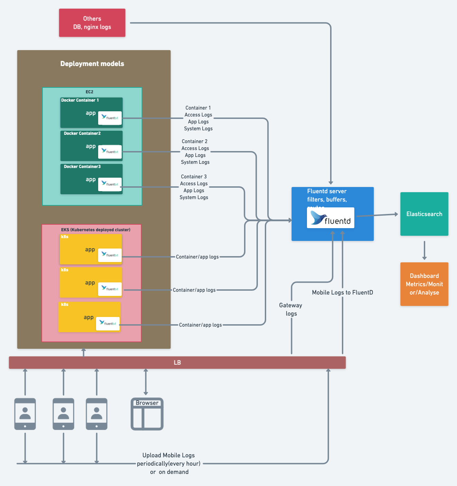

**Architecture diagram**

**Notes:** This is a small demo application for container based applications loggin architecture using fluent-bit and fluentd.
            Here Fluent-bit I have designed to use as a sidecar in applications deployed containers and Fluentd used as a 
            centralized log aggregator and can deploye as a service in any cloud environments like AWS/GCP/Azure. 
Follow the bellow steps to deploy for a working demo.

##Here I have given 3 different projects

####1) Spring Demo application whuck will generate logs for us
####2) Fluent-bit used to deploy as a sidecar app in spring boot app deployed container
####3) Fluentd as a service can deploy in local or other cloud environments.

Follow the README instructions in each project to deploy and test,

